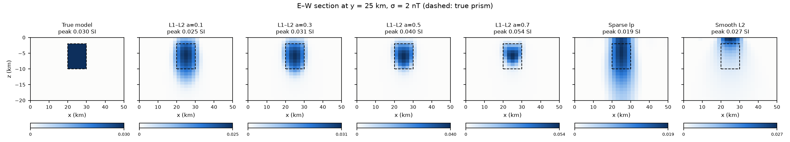
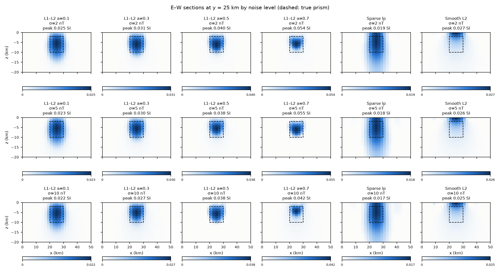
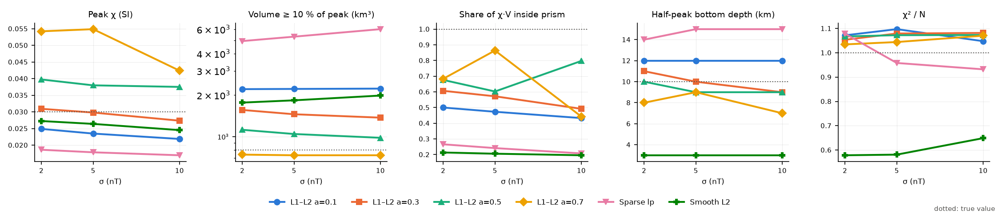

# L1–L2 正则化合成算例对比（仿 Nwosu & Becken 2025）

脚本：`examples/l1l2_paper_synthetic.py`（全部 18 次反演约 2 分钟，4 核）
输出：`examples/output/l1l2_paper_synthetic/`（`results.md`、`results.json`、图件）

## 设置

| 项目 | 取值 | 来源 |
|---|---|---|
| 数据 | TMI，B0 = 42000 nT，I = 45°，D = 30° | 论文 |
| 测网 | 26 × 26 测点，间距 2 km（50 × 50 km），高度 2 km（地面 z = 0） | 论文 |
| 噪声 | 高斯，σ = 2 / 5 / 10 nT（同一随机序列按 σ 缩放） | 论文（2 nT）/ 本文扩展 |
| 真模型 | 棱柱 χ = 0.03 SI，10 × 10 km，埋深 2–10 km，位于测区中心 | χ 取自论文；几何为自设 |
| 网格 | 28 × 28 × 20 = 15 680 单元，2 × 2 × 1 km，深至 20 km | 为控制运行时间而缩小 |

论文原文（academic.oup.com）在本环境被网络代理拦截，无法核对其合成体几何与网格，
因此棱柱尺寸与埋深是自行设定的，结果只能与论文作定性对比。

三类方法都经由 worker 的 `run_single_inversion`（与云端任务同一路径）：

- **L1–L2**：`regularization_type="l1l2"`，`l1_ratio` = α ∈ {0.1, 0.3, 0.5, 0.7}，‖g_j‖ 深度加权，界 [0, 1]。
- **Sparse lp**：`"sparse"`，worker 默认 norms (0, 2, 2, 1)、alpha_s = 1e-4，SimPEG 灵敏度加权，界 [0, 1]。
- **Smooth L2**：`"l2"`，`WeightedLeastSquares`，无深度加权、无界。

所有方法的目标拟合为 χ² = N（676）。

## 指标

- **峰值 χ**：恢复模型最大值（真值 0.03）。
- **紧凑度**：V≥10%——χ ≥ 峰值 10% 的体积（真值 800 km³）；以及恢复的 χ·V 落在真棱柱内的比例。
- **深度范围**：χ ≥ 峰值 50% 的单元所覆盖的深度（真值 2–10 km）；10% 阈值的范围见 JSON。
- **拟合差**：χ²/N 与 RMS（nT）；以及模型相对误差 ‖m−m*‖/‖m*‖。

## 结果（σ = 2 nT）

| 方法 | 峰值 χ | V≥10% (km³) | χ·V 在棱柱内 | 深度 ≥50% (km) | χ²/N | ‖m−m*‖/‖m*‖ |
|---|---|---|---|---|---|---|
| L1–L2 α=0.1 | 0.0249 | 2208 | 0.50 | 1–12 | 1.07 | 0.59 |
| L1–L2 α=0.3 | 0.0309 | 1560 | 0.61 | 2–11 | 1.05 | 0.52 |
| L1–L2 α=0.5 | 0.0398 | 1120 | 0.68 | 2–10 | 1.07 | 0.51 |
| L1–L2 α=0.7 | 0.0542 | 740 | 0.68 | 3–8 | 1.03 | 0.59 |
| Sparse lp | 0.0186 | 4928 | 0.27 | 0–14 | 1.08 | 0.74 |
| Smooth L2 | 0.0273 | 1764 | 0.21 | 0–3 | 0.58 | 0.88 |
| 真值 | 0.0300 | 800 | 1.00 | 2–10 | 1 | 0 |

σ = 5、10 nT 的完整表格见 `output/l1l2_paper_synthetic/results.md`。

## 结论

1. **α 控制紧凑度，与论文一致。** α 从 0.1 增至 0.7，V≥10% 从 2208 缩小到 740 km³（真值 800），
   峰值 χ 从 0.025 升到 0.054。α ≈ 0.3 时峰值最接近真值（0.031），α ≈ 0.5 时深度范围
   （2–10 km）与模型误差（0.51）最好；α = 0.7 体积对了，但峰值高估约 80%、底深上抬到 8 km。
2. **底深估计**（论文关注的"磁化底界"）：α = 0.3–0.5 的半峰底深为 9–11 km，贴近真值 10 km；
   α = 0.1 偏深（12 km，过度平滑），α = 0.7 偏浅（7–9 km）。
3. **噪声鲁棒性**：σ 从 2 增到 10 nT，L1–L2 的峰值下降 6–22%，V≥10% 变化 ≤ 12%，半峰深度范围变化 ≤ 2 km，拟合
   χ²/N 均为 1.03–1.10。高 α 在大噪声下最不稳定：σ = 10 nT、α = 0.7 时峰值降至 0.042、
   棱柱内比例降至 0.44（IRLS 在 23 次迭代时停止）。
4. **与对比方法**：
   - Sparse lp（worker 默认 norms (0,2,2,1)）在这里表现最差：异常沿深度拉长到 14–15 km，
     体积是真值的 6–7 倍，峰值只有 0.018。alpha_s = 1e-4 使平滑项主导，p_s = 0 几乎不起作用；
     这组默认参数是为深部网格调的，不代表 lp 方法的最佳表现。
   - Smooth L2 没有深度加权，异常被压在地表 0–3 km（经典的趋肤效应），且因 BetaSchedule
     跨过目标值而过拟合（χ²/N ≈ 0.6）。

## 局限

- "χ·V 在棱柱内"对 IRLS 的停止点敏感（同一设置下 40 次与 60 次迭代上限可相差 0.05–0.17），
  峰值、体积则稳定（差异 < 5%），半峰深度范围最多差 1 km；判读时应以后三者为主。
- λ（β）由目标拟合 χ² = N 决定，未做 L-curve / GCV（下一步任务）。
- 网格较粗（水平 2 km），棱柱边缘只有 5 个单元宽；α 的最佳值可能随网格和几何而变。
