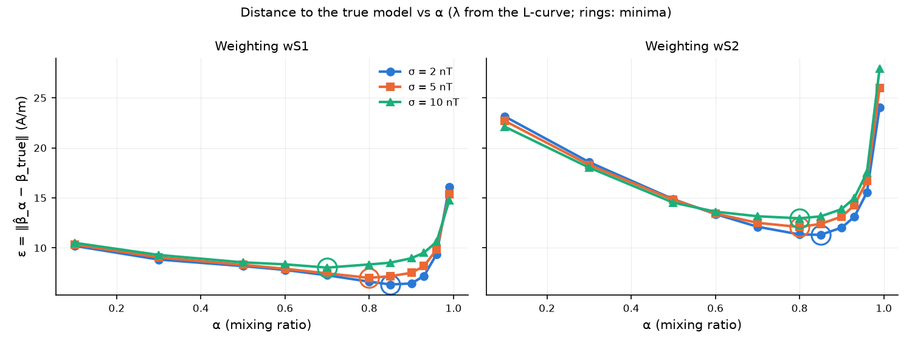
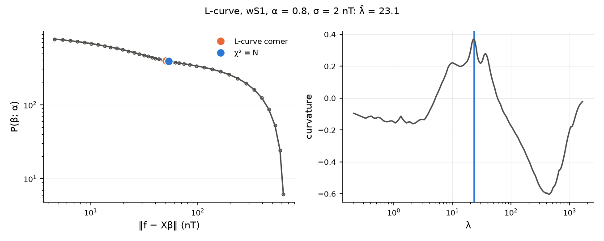
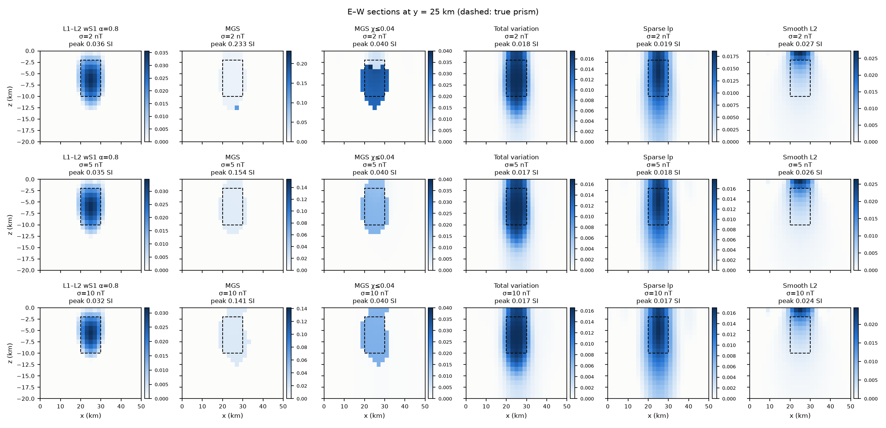
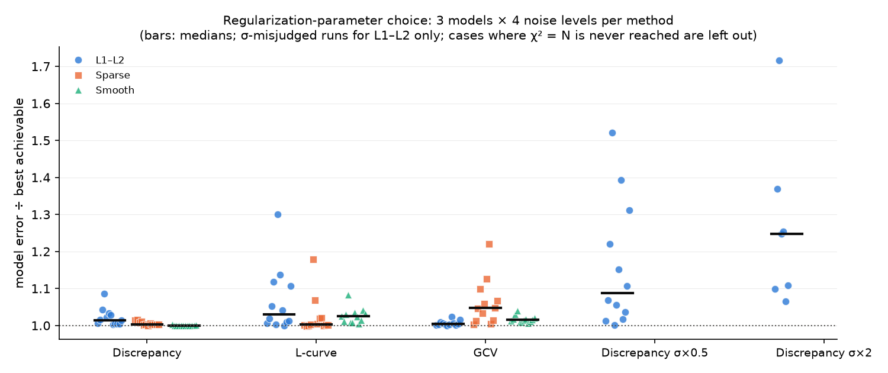

# L1–L2 正则化合成算例（按 Utsugi 2019 方法）及与 MGS、TV、Sparse、L2 的对比

脚本：
- `examples/l1l2_paper_synthetic.py`：Utsugi (2019) 的完整流程，包括 α 扫描、两种深度加权，以及与 Sparse、L2 的对比。66 条 λ 路径，4 核约 47 分钟。
- `examples/focusing_comparison.py`：MGS、TV、Sparse、L2 与最佳 L1–L2 的对比，约 2 分钟（需先运行上一个脚本）。
- `examples/lambda_selection.py`：单个算例上，对 IRLS 类方法（Sparse、Smooth L2、L1–L2 IRLS）比较偏差原理、L-curve、GCV。
- `examples/lambda_selection_benchmark.py`：3 个模型 × 4 个噪声水平上的 λ 选择对比（第 4 节）。
- `examples/regularization_viewer_demo.py`：把所有方法做成 DAG 节点，生成可交互查看器 `examples/regularization_comparison.geoinv3d_viewer.html`。

输出：`examples/output/{l1l2_paper_synthetic, focusing_comparison, lambda_selection, lambda_selection_benchmark}/`，每个目录都有 `results.md`、`results.json` 和图。

## 1. 设置

| 项目 | 取值 | 来源 |
|---|---|---|
| 数据 | TMI，B0 = 42000 nT，I = 45°，D = 30° | Nwosu & Becken 2025 |
| 测网 | 26 × 26 测点，间距 2 km，高度 2 km | Nwosu & Becken 2025 |
| 噪声 | 高斯，σ = 2 / 5 / 10 nT（同一随机序列按 σ 缩放） | 2 nT 取自论文，其余为本文扩展 |
| 真模型 | 棱柱 χ = 0.03 SI（磁化强度 1.00 A/m），10 × 10 km，埋深 2–10 km | 几何为自设（论文原文无法访问） |
| 网格 | 28 × 28 × 20 = 15 680 个单元，2 × 2 × 1 km，深至 20 km | 为控制运行时间而缩小 |

**L1–L2 方法（Utsugi 2019，代码 `geoinv3d/methods/l1l2_cda.py`）**

目标函数：

L = ½‖f − Xβ‖² + λ[(1−α)/2·‖β‖² + α‖β‖₁]

其中 β_j = s_j·β*_j，x_j = k_j / s_j。深度加权两种：wS1 取 s_j = ‖k_j‖^½，wS2 取 s_j = ‖k_j‖。

- **求解**：坐标下降（式 26 的软阈值更新）。λ 从 λ_max 起，按 Δlog10 λ = 0.1 递减 4 个数量级，每一步热启动；收敛判据为 ‖Δβ‖/‖β‖ < 1e-5。
- **加速**：每 20 次活动集扫描，直接求解一次活动集上的最优性条件。只有在符号和上下界都不变时才采用这个解，最终仍以一次完整 CDA 扫描判定收敛，所以解不变。α = 0.99 的路径因此从 10 分钟以上缩短到 1 分钟以内。
- **选 λ**：L-curve，即 ‖f − Xβ‖ 对 P(β; α) 的双对数曲线，用三次样条求最大曲率点，再在 λ̂ 处重新求解。
- **选 α**：α 事先固定。对每个 α 计算 ε = ‖β̂*_α − β*_true‖（A/m），取三个噪声水平下 ε 之和最小的 α。
- **与论文相同之处**：以磁化强度（A/m）求解，数据不按 σ 白化；不加上下界。

**对比方法**：全部经由 worker 调用，用偏差原理（χ² = N）选 β，并统一加正性约束（Smooth L2 除外）。
- Sparse lp：worker 默认设置，norms = (0, 2, 2, 1)。
- Smooth L2：无深度加权。
- MGS：最小梯度支撑（Portniaguine & Zhdanov）。
- TV：全变差。

## 2. α 扫描（论文图 7、10 的对应）

| 加权 | ε 最小时的 α（σ = 2 / 5 / 10 nT） | 三个噪声合计最优 | 论文结果 |
|---|---|---|---|
| wS1 | 0.85 / 0.8 / 0.7 | **0.8** | 0.96，与噪声无关 |
| wS2 | 0.85 / 0.8 / 0.8 | **0.8** | 0.90，与噪声无关 |

- α 增大，模型变得更紧凑，这点与论文一致。以 wS1、σ = 2 为例，V≥10% 从 2184 km³（α=0.5）降到 1444（0.8）、632（0.96）、380 km³（0.99）；峰值 χ 从 0.026 升到 0.036、0.071、0.129。
- 论文推荐的 α = 0.96（wS1）在"异常位于正确位置"上几乎完美：χ·V 在棱柱内的比例为 0.95–0.99，半峰深度 3–9 km。但体积只有真值的 60–80%，峰值高估约 2.3 倍，所以 ε 较大。α = 0.8 的幅值最准：峰值 0.032–0.036，棱柱内比例 0.74–0.81，深度 2–10/11 km。**最优 α 取决于更看重几何位置还是物性数值。**
- 与论文不同，本算例中最优 α 会随噪声增大而略有下降（wS1 从 0.85 降到 0.7）。
- **wS2 在本算例中不如 wS1，与论文结论相反。** 所有 α 下 wS2 的 ε 都更大（最小 11.3，wS1 最小 6.3），异常体被推深到 5–14 km，峰值高估约 2.5 倍。可能的原因是尺度差异：论文算例是测点高 50 m、深度 0.5 km 的浅部问题；本算例测点高 2 km、深度 20 km，‖k_j‖ 随深度的动态范围大得多，完全列归一化对深部补偿过度。
- L-curve 在 α ≥ 0.7 时给出的拟合为 χ²/N = 0.96–1.27，与偏差原理一致（见 L-curve 图，角点与 χ² = N 点几乎重合）。α 较小时 L-curve 偏向过拟合（wS1、α = 0.1 时 χ²/N = 0.36–0.69）。

## 3. 方法对比

σ = 2 nT（σ = 5、10 nT 的结果见 `output/focusing_comparison/results.md`）：

| 方法 | 峰值 χ | V≥10% (km³) | χ·V 在棱柱内 | 深度 ≥50% (km) | χ²/N | ε (A/m) |
|---|---|---|---|---|---|---|
| **L1–L2 wS1 α=0.8（CDA + L-curve）** | 0.0357 | 1444 | **0.74** | **2–11** | 0.99 | **6.62** |
| L1–L2 wS2 α=0.8 | 0.0764 | 904 | 0.80 | 5–12 | 1.13 | 11.35 |
| MGS（χ ≤ 1） | 0.2329 | 60 | 0.58 | 3–13 | 0.94 | 16.86 |
| MGS（χ ≤ 0.04） | 0.0400 | 1212 | 0.53 | 2–13 | 1.04 | 9.85 |
| TV | 0.0175 | 2920 | 0.39 | 0–14 | 0.92 | 9.38 |
| Sparse lp | 0.0186 | 4928 | 0.27 | 0–14 | 1.08 | 10.44 |
| Smooth L2 | 0.0273 | 1764 | 0.21 | 0–3 | 0.59 | 12.49 |
| 真值 | 0.0300 | 800 | 1.00 | 2–10 | 1 | 0 |

- **L1–L2 wS1（α = 0.8）最好**：不需要上下界，三个噪声水平下峰值误差在 20% 以内，深度范围正确，拟合 χ²/N = 0.99–1.25。
- **MGS 对聚焦参数 e 极其敏感**。在 σ = 2 下试了 e 取 L2 模型梯度模第 95 百分位的 0.5、1、1.5、2、3、10、30 倍，峰值依次为 0.11、0.23、0.36、0.018、0.019、0.019、0.019。也就是说，结果要么塌缩成一个小的高值体，要么几乎不聚焦。加上接近真实的先验上界（χ ≤ 0.04）后 MGS 变得稳定，得到边界清晰的块状体（体积 1160–1230 km³），但深度方向有所拉长，而且需要事先知道 χ 的上限。
- TV 的效果接近 Sparse：在深度方向拖尾到 14 km，但 ε 比 Sparse、L2 都小。
- Sparse（worker 默认的 norms (0,2,2,1)、alpha_s = 1e-4）由平滑项主导，异常拉长到 14–15 km。Smooth L2 没有深度加权，异常集中在地表 0–3 km，并且过拟合。

## 4. λ 选择：偏差原理、L-curve 与 GCV 的对比

脚本 `examples/lambda_selection_benchmark.py`（36 个任务，4 核约 26 分钟），输出在 `output/lambda_selection_benchmark/`。

**设置**
- **3 个模型**：单棱柱；深浅两个异常体（浅部小块 1–4 km、χ = 0.03；深部大块 6–14 km、χ = 0.02）；45° 倾斜板状体（2–12 km）。
- **4 个噪声水平**：σ = 2 / 5 / 10 / 20 nT。
- **3 种方法**：L1–L2（CDA、wS1、α = 0.8）、Sparse、Smooth L2。
- **打分方式**：在整条 λ/β 扫描中找出与真模型误差最小的点（"事后最优"，实际中无法得到），用每个准则的模型误差除以这个最优误差，1 表示最好。
- **σ 估错的影响**：另外测试偏差原理在 σ 被估成一半或两倍时的表现，只在 CDA 路径上做。

模型误差 ÷ 事后最优，格式为"中位数、最差；超过 1.25 的算例数"：

| 方法 | 偏差原理 | L-curve | GCV | 偏差原理（σ 估成一半） | 偏差原理（σ 估成两倍） |
|---|---|---|---|---|---|
| L1–L2 | 1.01, 1.09; 0/12 | 1.03, 1.30; 1/12 | 1.00, 1.02; 0/12 | 1.09, 1.52; 3/12 | 1.25, 1.72; 3/7（另 5 个达不到 χ² = N） |
| Sparse | 1.00, 1.02; 0/12 | 1.00, 1.18; 0/12 | 1.05, 1.22; 0/12 | – | – |
| Smooth L2 | 1.00, 1.00; 0/12 | 1.02, 1.08; 0/12 | 1.01, 1.04; 0/12 | – | – |

各准则选出的 χ²/N（中位数）：

| 方法 | 事后最优 | 偏差原理 | L-curve | GCV |
|---|---|---|---|---|
| L1–L2 | 0.74 | 1.00 | 1.07 | 0.64 |
| Sparse | 0.84 | 0.95 | 0.80 | 0.64 |
| Smooth L2 | 0.77 | 0.85 | 0.32 | 0.31 |

**结论**
- **σ 准确时，三种准则的差别很小。** 模型误差都在事后最优的 1.3 倍以内，因为位场反演的模型误差随 λ 变化很平缓，主要受非唯一性限制。偏差原理最稳。GCV 在 L1–L2 上与事后最优几乎一样（最差 1.02），在 Sparse 上稍差（最差 1.22）。L-curve 的最差值最大（L1–L2 两个异常体、σ = 5 时为 1.30）。
- GCV 选出的 χ²/N 偏低（约 0.64），但事后最优的模型本身也有些过拟合（χ²/N 为 0.74–0.84），所以 GCV 的模型误差并不差。**之前根据单个算例说"GCV 系统性过拟合、不建议单独使用"，这个说法过于悲观。**
- **σ 估错的代价远大于选哪种准则。** σ 估成两倍时误差可达 1.72 倍，而且 12 个算例里有 5 个在 4 个数量级的 λ 路径范围内达不到 χ² = N；σ 估成一半时最大 1.52 倍。这正是 L-curve 和 GCV 的价值所在：它们都不依赖 σ。
- **L 曲线有时没有拐角**（曲率处处不为正），例如小规模、容易过拟合的问题。代码会检测这种情况：L1–L2 的 `auto` 模式会自动改用 χ² = N，其他情况给出警告，查看器里也会显示。
- **建议**：σ 可靠时用偏差原理（worker 默认）；σ 不可靠时，L1–L2 用 GCV 或 L-curve，Sparse 优先用 L-curve，Smooth L2 用两者都可以（GCV 略好）；无论哪种，都要检查 χ²/N 和查看器中的曲线。

## 5. 局限

- 论文原文（academic.oup.com）在本环境中无法访问，棱柱几何为自设，与论文只能作定性对比。
- 网格较粗（水平 2 km），棱柱宽度只有 5 个单元。wS1 与 wS2 孰优孰劣、最优 α 是多少，可能都随网格和几何而变。
- ε 按全体单元计算，对幅值误差敏感；χ·V 在棱柱内的比例则更反映几何位置。两者给出的最优 α 不同（0.8 对 0.96），报告中都已列出。
- CDA 的收敛判据与论文相同（相对变化 < 1e-5），KKT 相对残差约为 1e-4 到 3e-3。
